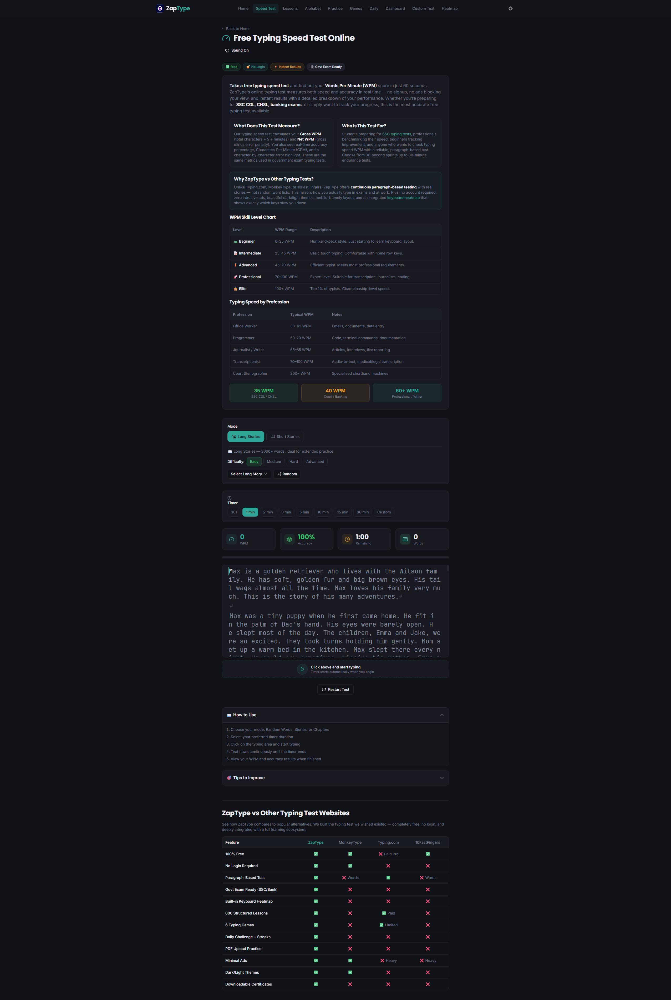
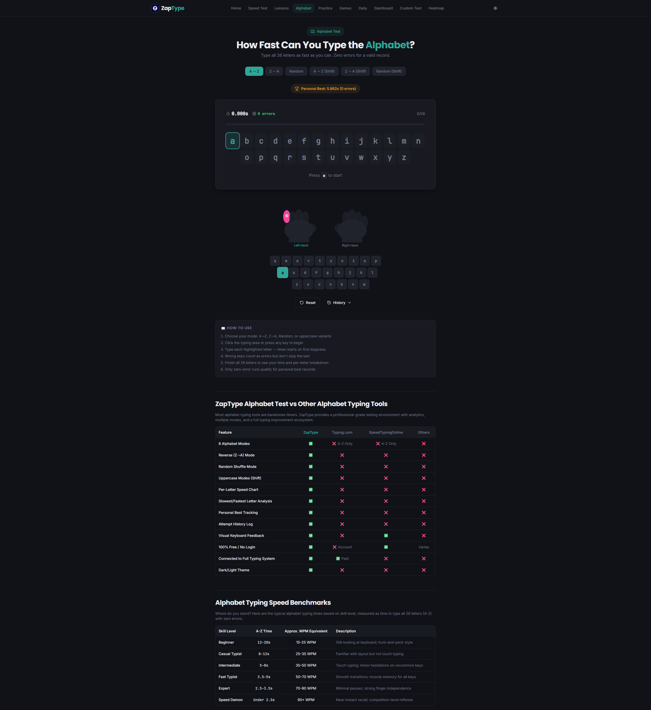

# ZapType ⚡

Modern **typing speed test platform** with lessons, games, and analytics.

ZapType is designed to make typing practice **engaging, interactive, and measurable**.

🌐 **Live Website**  
https://zaptype.in

---

## 📸 Preview

<table>
<tr>
<td align="center">
 
<b>Homepage</b>
</td>

<td align="center">
 
<b>Typing Speed Test</b>
</td>
</tr>

<tr>
<td align="center">
 
<b>Progress Dashboard</b>
</td>

<td align="center">
 
<b>Alphabet Typing Test</b>
</td>
</tr>
</table>

# 🚀 Features

ZapType combines learning, testing, and analytics in one place.

### ⌨️ Typing Tools
- Typing Speed Test
- Typing Speed Practice
- Custom Text Typing
- Alphabet Typing Test

### 🎯 Learning System
- Structured Touch Typing Lessons
- Accuracy Training
- Progressive Skill Development

### 🎮 Gamified Practice
- Typing Games
- Daily Typing Challenges
- Interactive Practice Modes

### 📊 Analytics & Tracking
- Progress Dashboard
- WPM Analytics
- Accuracy Tracking
- Keyboard Heatmap

---

# 📊 Why ZapType?

Most typing websites are **outdated or limited**.

ZapType was built to combine **learning + practice + analytics + gamification** into one modern platform.

With ZapType you can:

✔ Improve typing speed  
✔ Practice touch typing effectively  
✔ Track progress with real analytics  
✔ Identify weak keys using heatmaps  
✔ Make typing practice engaging

All in **one unified platform**.

---

# 🧪 Tools Available

ZapType provides multiple tools to improve typing performance:

- Speed Test
- Typing Practice
- Touch Typing Lessons
- Alphabet Typing Test
- Typing Games
- Progress Dashboard
- Custom Text Practice

---

# 👨‍💻 Built by an Indie Developer

ZapType is a **solo indie developer project** built to improve how people learn and practice typing online.

No team.  
No funding.  
Just continuous improvement and experimentation.

---

# 🌍 Try ZapType

Experience the platform here:

👉 https://zaptype.in

---

# ⭐ Support ZapType

If you like ZapType, please consider **starring this repository**.

Your support helps the project reach more developers and typing enthusiasts.

⭐ Star the repo  
🌐 https://zaptype.in
